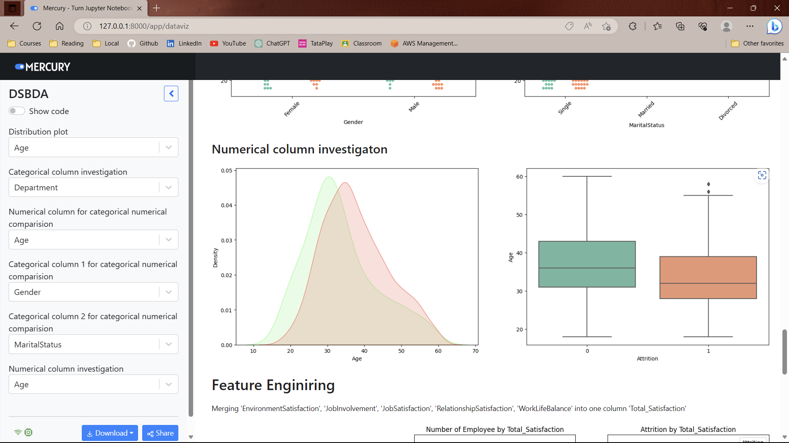

<!-- comment by copilot -->
<h1>DSBDA-Project</h1>
<h2>Data Science and Big Data Analysis Mini-Project</h2>
<strong>Employee attrition prediction</strong>

Predicting that employee will leave the current company using several machine learning algorithms.

<h3>Building requirements</h3>
<ul>
    <li>Open command prompt and run as administrator.</li>
    <li>Change path to project directory.</li>
    <li>Install all the required python libraries (Make sure you have python installed)
     
    Run command: <code>pip install -r requirements.txt</code>
    </li>
</ul>

<h3>Building the Model</h3>
<ul>
    <li>Run 'model-build.py' to build the prediction model.
     
    Run command: <code>py model-build.py</code>
    </li>
</ul>

<h3>Starting the Web App</h3>
<ul>
    <li>Open command prompt in the project directory</li>
    <li>Start the mercury Web App server on localhost (default port = 8000)
     
    Run command: <code>mercury run</code>
    </li>
    <li>Open 'DataViz' App to study data visualization</li>
    <li>Open 'PredictionModel' App to predict Employee Attrition</li>
</ul>

<h3>Mercury interface</h3>
<ul>
    <li>Toggle 'Show code' button to view source code</li>
    <li>Select values from dropdown lists</li>
    <li>Enter custom input in textbox</li>
</ul>

<h3>Project screenshots</h3>
 

